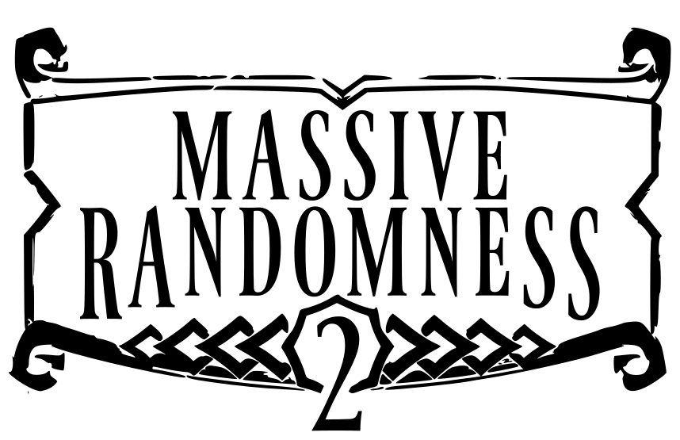
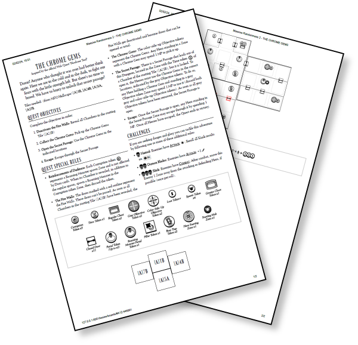

# Massive Randomness 2

A Massive Darkness 2 one-shot quest random generator.

---

<a href="https://www.kesiev.com/massive-randomness-2/">Generate a quest</a>

---

## The story

Great Heroes. You managed to survive Hell and Heaven, you fought hordes of Angels and Demons, you braved Ice and Fire. But a new enemy awaits, one of horror and chaos. Are you ready to face the **Massive Randomness**?

## The project

**Massive Randomness 2** is a [Massive Darkness 2](https://boardgamegeek.com/boardgame/315610/massive-darkness-2-hellscape) board game one-shot quest random generator. It will select a scenario model from its database, randomize part of the narrative for added fun, and create a matching randomly generated dungeon for you. It will also generate a set of random **challenges** you may want to accept to make your dungeon crawling experience a little more fun (and deadly). Just go to [the project page](https://www.kesiev.com/massive-randomness-2/) to give it a shot. Hit the black die button on the top right to generate a new quest or the hamburger menu button on the top left to show a few settings.

    

The generated quests are designed to be disposable but, if you prefer, you can print them on paper from your browser. The result is not as rich as that of the original quests but the layout is designed to be readable even when printed in black and white.

### Why?

_Massive Darkness 2_ is a nice light scenario-based hack & slash dungeon crawler board game with hordes of enemies to kill and tons of loot to grab. The game scenarios, both included in the game manual or found around the internet, are kept replayable both by randomizing enemies and events and by adding expansions, which mostly are more enemies and Hero classes to drop into its random pools.

I've been looking for _that Diablo-esque tabletop experience_ for a long time and this game is the closest thing I've found: total ignorance, immense character growth, and death just around the corner. All that's missing are the random dungeons... and that's how this project was born.

### Credits

The challenges feature is inspired by the [Dungeon Skill Challenge](https://boardgamegeek.com/filepage/245223/dungeon-skills-challenge) variant by **anubys** and by the **Hard Mode** rules of the official web-quest **Hardcore Trial**.

_Dungeon Crawling Mode_ suggested by [kaarol116](https://boardgamegeek.com/user/kaarol116).

Finally, I've used the excellent [Seshat](http://dotcolon.net/font/seshat/) and [Ferrum](https://dotcolon.net/font/ferrum) fonts by Dot Colon even this time.

_Massive Darkness 2 and all related properties are owned by CMON Global Limited._
