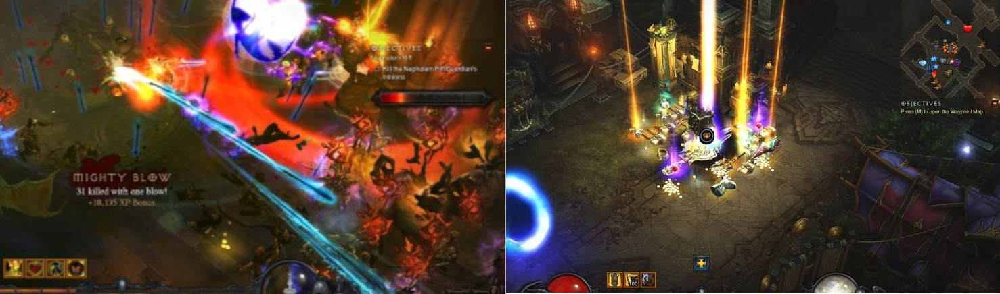
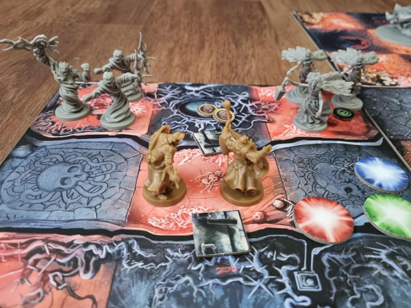
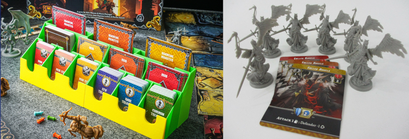

# Massive Randomness 2

A Massive Darkness 2 quest and campaign random generator.

---

<a href="https://www.kesiev.com/massive-randomness-2/">Generate a quest</a> | <a href="https://boardgamegeek.com/thread/3242331/massive-randomness-2-very-beta-one-shot-quest-rand">BGG discussion thread</a>

---

## The story

Great Heroes. You managed to survive Hell and Heaven, you fought hordes of Angels and Demons, you braved Ice and Fire. But a new enemy awaits, one of horror and chaos. Are you ready to face the **Massive Randomness**?

## The project

**Massive Randomness 2** is a [Massive Darkness 2](https://boardgamegeek.com/boardgame/315610/massive-darkness-2-hellscape) board game quest and campaign random generator. It will select a scenario model from its database, randomize part of the narrative for added fun, and create a matching randomly generated dungeon for you. It will also generate a set of random **challenges** you may want to accept to make your dungeon crawling experience a little more fun (and deadly). Just go to [the project page](https://www.kesiev.com/massive-randomness-2/) to give it a shot. Hit the black die button on the top right to generate a new quest or the hamburger menu button on the top left to show a few settings.

    

The generated quests are designed to be disposable but, if you prefer, you can print them on paper from your browser. The result is not as rich as that of the original quests but the layout is designed to be readable even when printed in black and white.

### Why?

_Massive Darkness 2_ is a nice light scenario-based hack & slash dungeon crawler board game with hordes of enemies to kill and tons of loot to grab. The game scenarios, both included in the game manual or found around the internet, are kept replayable both by randomizing enemies and events and by adding expansions, which mostly are more enemies and Hero classes to drop into its random pools.

I've been looking for _that Diablo-esque tabletop experience_ for a long time and this game is the closest thing I've found: total ignorance, immense character growth, and death just around the corner. All that's missing are the random dungeons... and that's how this project was born.

#### The Campaign mode

What I liked the most about Massive Darkness 2 design are the slim systems that keep the game balanced and interesting without breaking its pace.

Enemies equipment deck is separated from loot decks, containing different cards. This way, the game can scale these items' strength following the enemy's level regardless of the item _quality_, and these items' exclusivity makes sure that the battles are always interesting to the player.

Most of the enemies have _two level values_ (i.e., there are Level 1-2, Level 3-4, and Level 5 enemies) and are represented by a single card. This keeps the interface clear (all the information on the card is meaningful), creates a nice _sawtooth pace_ to the game (the enemy/player advantage ramps up and down from level to level), and makes the dungeon difficulty changes seamless (just draw cards from another deck when needed).

There are many of these systems around the game, all flexing for around 15 game rounds to keep the game flowing and engaging.

When I read the campaign expansion _Heavenfall_ manual's first pages I wondered _how far_ these small systems can stretch to hold a longer campaign. 6 months after Massive Randomness 2 first release, me and my wife found the time to play and clear it.

Avoiding spoilers, the _load_ on these systems has been cleverly spread around the campaign, allowing them to relax from quest to quest. It makes the game _a little more conventional_ and the systems and game materials show some _stretch marks_, but it still manages to keep that _action RPG_ mood intact. Moreover, it allows playing the same character longer to see their growth more clearly.

The Heavenfall campaign uses a lot of extra game material that can't be used in one-shots (i.e., the city, some special items, and Level 6-10 enemies/heroes) so I've attempted a _random campaign generator_ for Massive Randomness 2 to give them some kind of _second life_. I did my best to _squeeze_ the material I've got and wrap it with a story that goes deeper into _The Massive Randomness_ lore. I hope you'll like it!

#### Boss fights

In most of the _Diablo-like_ action-RPG videogames I've played, while the enemies are designed to be as _intimidating_ as possible in any possible way (character design, size on the screen, stats, horde size, etc.), they rarely are there to _create a direct challenge_ to the players as it happens on many games. They feel more like _character build gates_ and ways to give the players _more elements to improve their build_. If the players can push their carefully crafted builds enough to beat the enemies, there are two prizes to them: an _adrenaline_ burst for winning as an outnumbered hero and a _dopamine_ burst from the spray of loot that comes from their corpses, to be used to improve that build even more.

    

    
Diablo 3 screenshots summarizing two key ingredients of the genre: adrenaline bursts by eliminating huge enemy hordes and dopamine bursts from loop sprays.

I've found this _enemy as gates_ principle in many cooperative/solitaire board games. In one of my favorite boss battlers [Aeon's End](https://boardgamegeek.com/boardgame/191189/aeons-end), bosses mostly challenge the players to create and manage _strong enough_ builds _by the end of the game_. Even the cute trick-taking game [For Northwood!](https://boardgamegeek.com/boardgame/334590/for-northwood-a-solo-trick-taking-game) uses a similar approach, even if more subtle: "enemies" are _a goal_ the player must reach by evaluating their hand of cards and their _allies set_.

What's hard to bring to the board are the rewards' _adrenaline_ and _dopamine_ bursts. Strictly both.

Massive Darkness 2 attempts to implement them with tons of plastic and cards. Hordes mostly behave like single enemies but they are made by _multiple miniatures with a scary general miniature_ and bosses are _huge sculptures scaringly moving in a tight room_, so taking them down in a few hits provides that _adrenaline_ effect. Getting rid of enemies often gives you _multiple_ random and valuable item cards you can use _right away_ to improve your character - and that fixes the _dopamine_ part.

    

    
Opening a single regular room door in a 2-player Massive Darkness 2 game may spawn 6 enemies near the players that will attack them right after the end of the round, mimicking the ARPG hordes. This room also provides 6 item cards (2 weapons wielded by the enemies, 2 extra rewards from beating them, and 2 by picking the loot tokens on the ground), providing the loot spray feeling.

But there is a price to pay for that. In this case, _literally_. Players have to purchase all of this plastic and these cards to play the game. All of this plastic and cards are destined to randomly appear on the table, to be consumed in a flash, and not to be seen for many quests. Board game designers usually attempt to maximize their components reuse instead, creating synergies between elements, reusing them for multiple purposes, or changing their behavior with the context.

So Massive Darkness 2 probably decided not to do that _to create a very specific experience and pace_ and maybe this decision has been the game's blessing to be so good to people looking for this specific kind of game, and the game's curse to require designing and producing a lot of stuff to add something impactful to the game.

    

    
On the left, an organizer with some of the Massive Darkness 2 base game cards: when a horde or a Roaming Monster is eliminated one or more of the the small cards on the front row are gained. On the right, the Fallen Angels enemies set: a horde is composed by 1 Leader plus a number of Minions equal to the number of Heroes in the game, always outnumbering them.

Looking for Massive Randomness 2 feedback on the internet I discovered that the tool is mostly used to _give more life to a good but abandoned game_ and a recurring feature request is to add _Boss Fights_ to the generated quests. I think that some people want to _squeeze_ a little more _adrenaline and dopamine_ from their favorite game's components.

Massive Randomness 2 was missing bosses since they do not scale with the player's level as the other enemies and are tied to specific scenarios, so some adaptation was needed to add them. Moreover, they take little time to be taken down and give no loot.

But they are the _character build gates_ of Massive Darkness 2: huge miniatures to be fight in a tight space ready to give one last _adrenaline burst_ to the players. So I've kicked some data on a spreadsheet and attempted to adapt them to almost all the generated quests. I hope it will do the job!

### Technical notes

 * If your browser supports PWA and Service Worker, you should be able to install MR2 on your device from the browser options menu and use it offline. Offline support for web applications has been a bit esoteric in the past and still is, so it may not work for you. If you intend to self-host MR2 and do not want this functionality, please remove/comment out the inclusion of the `js/installer.js` script in `index.html`.

### Credits

The challenges feature is inspired by the [Dungeon Skill Challenge](https://boardgamegeek.com/filepage/245223/dungeon-skills-challenge) variant by **anubys** and by the **Hard Mode** rules of the official web-quest **Hardcore Trial**.

Finally, I've used the excellent [Seshat](http://dotcolon.net/font/seshat/) and [Ferrum](https://dotcolon.net/font/ferrum) fonts by Dot Colon even this time.

_Massive Darkness, Zombicide, and all related properties are owned by CMON Global Limited._
